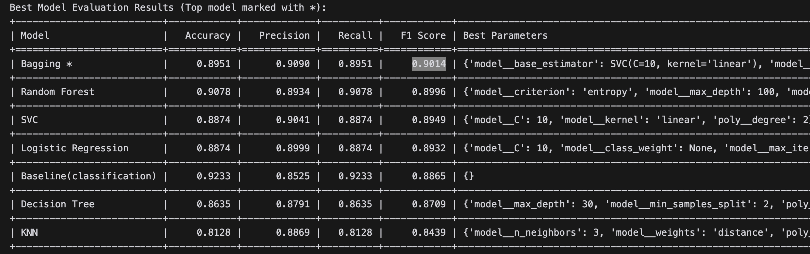
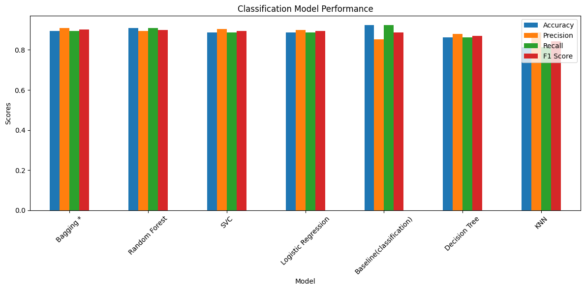
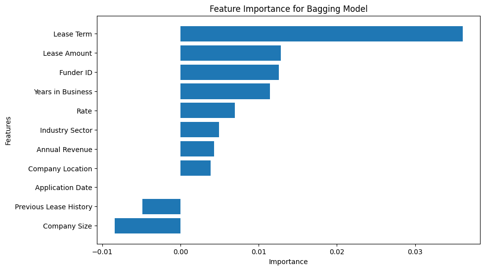

# Exploratory Data Analysis for Predicting Leasing Approvals

**Author: Ok Ikejiani**

## Executive summary
### Context

Our client, a Canadian-based equipment leasing company (hereafter referred to as "the Client") specializes in purchasing and leasing equipment to various businesses across Canada. The Client collaborates with a network of funders who provide the capital necessary for each lease agreement. Companies seeking to lease equipment submit applications to the Client, who then works to get these applications approved by their funders.

Successful approvals are crucial for the Client's business growth and reputation among funders. Funders often limit the number of deals they process at a time due to risk management concerns. However, they are more inclined to increase this limit when they observe that a broker consistently submits applications that are approved and lead to successful leases. Each approved application that defaults not only results in financial loss but also represents a significant opportunity cost, affecting the Client's credibility with funders.

Currently, the Client invests considerable time and resources into due diligence, including extensive back-and-forth communications and on-site business visits. While this thorough process helps in securing approvals, it is not scalable without proportionally increasing headcount—a challenge the Client aims to overcome. With the recent migration from a paper-based system to a digital application portal (Phase 1 of their digital transformation), the Client has experienced an influx of applications. They now receive hundreds of requests weekly and need an efficient way to prioritize these applications to maximize successful approvals.

Leveraging artificial intelligence presents a new opportunity (Phase 2 of their transformation) to help the Client scale their operations without significantly increasing personnel by predicting the likelihood of application approvals and focusing efforts on the most promising candidates.

### Problem Statement

The Client seeks to enhance their leasing approval process by predicting the likelihood of application approvals based on available data. This predictive capability will enable them to:
Increase the number of successful applications submitted to funders.
Prioritize organizations with a higher chance of approval.
Scale their operations efficiently without a significant increase in headcount.

### Project Overview

This project aims to develop a predictive model that assesses the likelihood of lease application approvals. By analyzing historical application data and identifying key factors that influence funder decisions, the Client can optimize their application submission strategy. The model will help in:
- Streamlining the due diligence process by focusing on high-probability approvals.
- Enhancing relationships with funders by consistently submitting quality applications.
- Allocating resources effectively to handle the most promising leads.

## Research Question

Can we predict the likelihood of lease application approvals for Canadian companies looking to lease equipment and software in a way that minimizes poor leads without missing opportunities?

An addtional Research Question is, Do external factors such as interest rates have an impact on the approval of lease applications?

## Rationale(Why this question is important?)

Efficiently processing lease applications is crucial for the company's growth and sustainability in a competitive market. With the recent influx of applications due to the new digital portal, the company faces the challenge of prioritizing which applications to focus on without overwhelming their resources or increasing headcount.
By answering this question, the company stands to gain significant benefits:
- Resource Optimization: Predicting approval likelihood allows the company to allocate time and effort toward applications that are more likely to be approved, reducing wasted resources on low-probability cases.
- Operational Scalability: Implementing a predictive model enables the company to handle a higher volume of applications efficiently, supporting business growth without the need for proportional staff increases.
- Enhanced Funder Relationships: Consistently presenting high-quality applications improves the company's reputation with funders, which may lead to increased funding limits and better terms, directly impacting profitability.
- Strategic Decision-Making: Understanding the key factors that influence approvals empowers the company to guide applicants on improving their profiles, potentially increasing overall approval rates.
- Competitive Advantage: Leveraging data analytics and predictive modeling positions the company ahead of competitors who may not utilize such advanced techniques, attracting more business and fostering customer trust.

## Data Sources

The data used in this project is provided by the Client. It includes historical application data, including features such as company size, industry sector, lease amount, years in operation, and interest rates. The data also includes information on the application outcome, with each application classified as approved or denied.

## Methodology:

### 1. Exploratory Data Analysis (EDA):
In the initial phase of the process, I focused on gaining a deep understanding of the dataset. Key steps included:
- Visualizing the distribution of important features such as company location, annual revenue, and other relevant variables.
- Checking for missing values and identifying outliers to ensure that the data was clean and accurate for analysis.
- Analyzing the relationships between various features and the target variable (approval status), which helped provide insights into patterns that might influence approval decisions.
- I also analyzed the relationship between the interest rates and the approval status of the lease applications.

### Data Cleaning and Splitting:
- I cleaned the data by removing missing values and outliers.
- I split the dataset into training and test sets to evaluate model performance on unseen data effectively.
- I used cross-validation techniques such as K-fold cross-validation to ensure that the model was generalizing well and not overfitting to the training data.
- I also used SMOTE to handle the imbalance in the dataset.
### 2. Feature Engineering:
- I created new features to enhance the model's predictive power by aggregating and transforming existing variables. For example:
- I generated features like company size and lease history to derive more insights into lease application behavior.
- I also created features that combined multiple variables to capture complex relationships between features.
- Categorical variables were encoded using both ordinal and one-hot encoding to ensure proper handling by the models, and I standardized features to prepare them for machine learning algorithms.

### Model Selection:
- I first trained a DummyClassifier model to get a baseline model to compare the performance of the other models.
- I then trained multiple machine learning models to predict lease approvals, including Logistic Regression, KNN, Decision Trees, SVM, Random Forest.
- Hyperparameter tuning was conducted using Grid Search to optimize model performance and ensure that the models were appropriately configured.
- Finaly, a Bagging ensembale model was used to improve the performance of the top model.
  
### Model Evaluation:
- I evaluated the trained models on various performance metrics such as accuracy, precision, recall, F1-score, and ROC-AUC to assess how well they balanced minimizing poor leads without missing opportunities. The primary metric used was *F1-score*. F1 Score was chosen because it is a balanced metric that considers both precision and recall, which are crucial for this project. While we want to miniminze the chances of approving poor leads, we also want to avoid missing opportunities to approve good leads which is why F1 Score is a good metric to use.
- I analyzed feature importance to understand which factors, such as company location, annual revenue, and lease history, had the greatest impact on lease approval predictions.

## Results
The best performaning model was the Bagging model with a SVC model as the base estimator(F1 Score of 0.9).

The feature importance plot shows that the most important features in predicting the likelihood of lease application approvals are the Lease term. 
1. Lease Term has the highest importance, meaning the length of the lease is a major factor in predicting approval. This makes sense as longer lease terms might signal higher risk or commitment from the funder’s perspective.
2. Lease Amount is also highly significant, suggesting that the size of the lease is critical in determining approval likelihood.
3. Funder ID, Years in Business, and Rate follow in importance, indicating that both the identity of the funding institution and the stability of the applicant's business (years in operation and rates) are key factors in approval decisions.
4. Other features like Industry Sector, Annual Revenue, Company Location, and Company Size contribute less but still play a role in the model.

## Next steps
- Test addtional models such as XGBoost to see if they perform better.
- Futher feature engineering techniques such as creating a new feature that combines multiple variables to capture complex relationships between features or removing features that had a negative impact on the model's performance.
- Additonal hyperparameter tuning to improve the performance of the model.
- Prepare the best performing model for deployment to be used by the client along side their current system(not to replace, but to test how well it is able to predict the approval of lease applications).
- Investigate why the bagging model performance degrades when the estimator property is used instead of base estimator property.

## Outline of project

- [The EDA Notebook](predictive_leasing_approvals_exploratory_data_analysis.ipynb)

